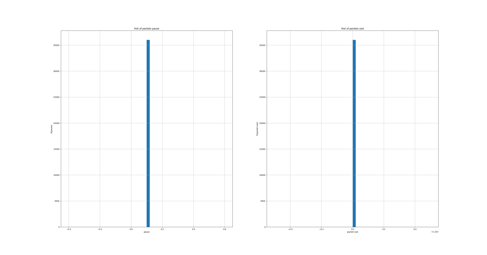
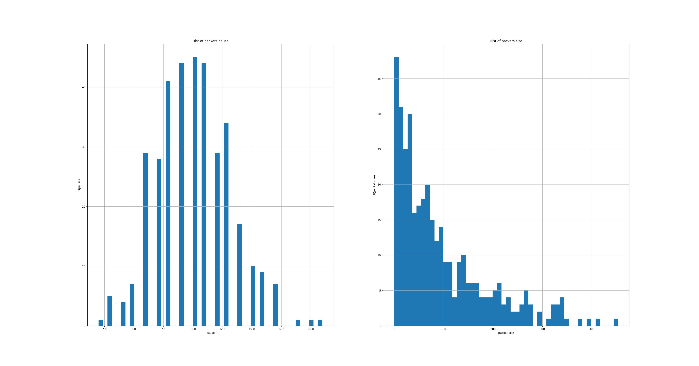
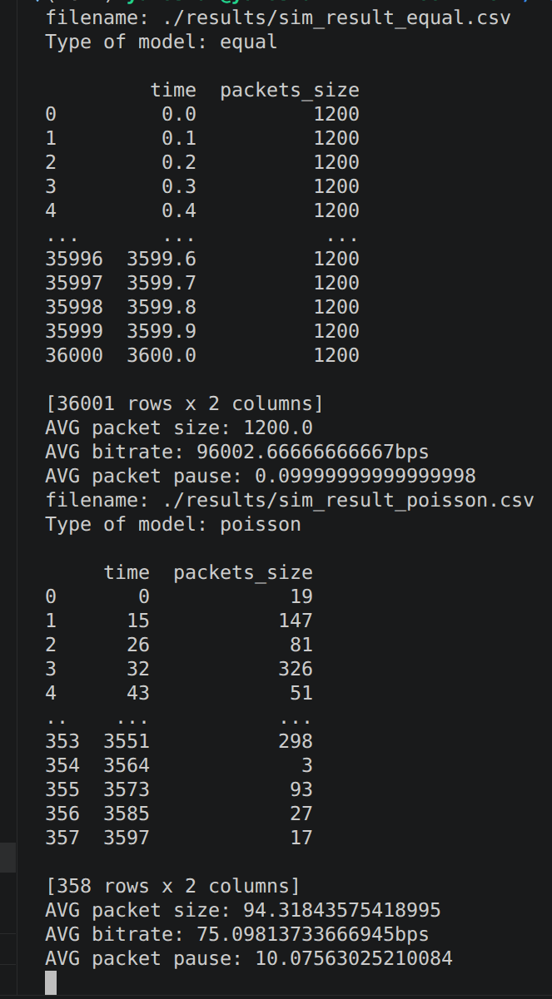
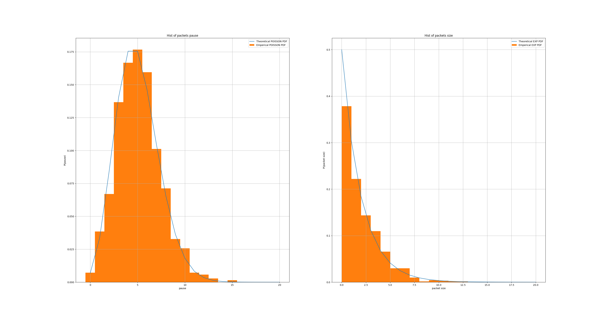
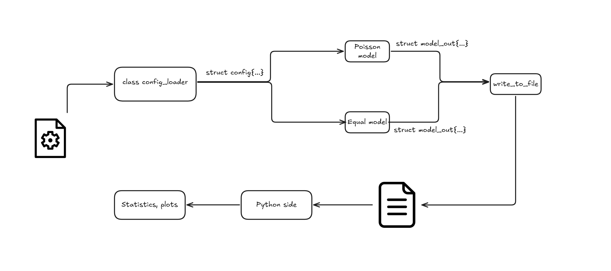
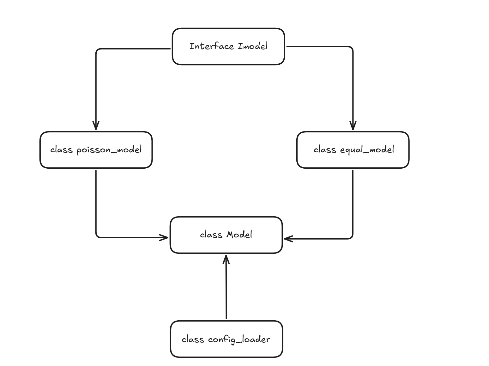

# Тестовое задание YADRO IMPULSE 2026

Ссылка на [репозиторий](https://github.com/YaroslavGmyrya/yadro-test-task-2)

## Запуск
BASH скрипт, запускающий C++ и Python части последовательно
```
./run.sh ./conf/poisson.conf ./conf/equal.conf
```

Компиляция
```
mkdir -p build && cd build
cmake ..
make
./tests
./main <filename>
```

## Структура проекта
1. /build - директория для сборки, хранит бинарные файлы main и tests
2. /conf - директория для хранения конфигов для C++ стороны
3. /cpp - исходный код C++ стороны
    * include - заголовочные файлы
    * src - исходники
4. /python - исходный код для Python стороны
5. /results - директория, куда C++ пишет .csv
6. /tests - тесты для функций C++ стороны
7. install.sh - установка необходимых зависимостей

## Результаты

Результатом работы является анализ данных, полученных с C++ стороны проекта, на Python стороне.


Строятся гистограммы для размеров пакетов и пауз между пакетами. Для равномерной модели всё просто - размеры пакетов всегда одинаковые, как и паузы, поэтому на гистограмме наблюдаем один столбик. 




Для модели с пуассоновским и экспоненциальном распределением также строятся гистограммы. Для распределения Пуассона $\lambda$ = 10, а для экспоненциального распределения $\lambda$ = 0.01.



В консоль выводятся остальные характеристики. При вычислении среднего битрейта я принимал размеры пакетов за байты.


Для распределения Пуассона математическое ожидание равно $\lambda$, а для экспоненциаьлного - $\frac{1}{\lambda}$. Математическое ожидание для пауз между пакетами должно быть равно 10, а для размера пакетов - $\frac{1}{0.01}=100$. Эмпирические данные близки к теории, что говорит о правильности работы модели.

### Дополнительно

Чтобы убедиться в правильности работы модели, я построил теоретические графики PDF для экспоненциального и пуассоновского распределениия 



Теоретические значения очень близки к эмпирическим, что говорит о правильной работе модели.

### Пояснения к коду

В проекте используются только стандартные библиотеки C++ за исключением библиотеки spdlog для логирования.

#### Загрузка конфига
За загрузку конфига отвечает отдельный класс **config_loader**. Класс имеет один публичный метод **load_config**, который запускает pipeline для загрузки конфига, включающий:

1. Чтение конфига
2. Проверка формата файла и значений
3. Парсинг и запись данных в структуру **config**

Остальная логика, составляющая pipline, скрыта.

Формат входного файла:
1. Первая строка - число с плавающей точкой, время симуляции модели в секундах.
2. Вторая строка - имя модели ("equal" или "poisson"). Далее для equal указываются 2 числа: первое - пауза между пакетами, второе - размер пакетов. Для poisson указываются 2 числа: первое - $\lambda$ для пуассона, второе - $\lambda$ для экспоненциального распределения.

#### Модели трафика

Для масштабируемости кода есть интерфейс **Imodel**, который содержит 1 абстрактный метод. Интерфейс подсказывает, какой минимальный функционал должен реализовывать класс, представляющий модель, чтобы остальной код мог корректно с ним работать.

Классы **equal_model** и **poisson_model** модели наследуют этот интерфейс и реализуют.

Класс **Model** собирает в себе весь функционал: модели трафика и загрузчик конфига. Он имеет 1 публичный метод, вызывающий pipeline модели, который выполняет:

1. Загрузку конфига
2. Генерацию данных моделью
3. Запись данных в файл



